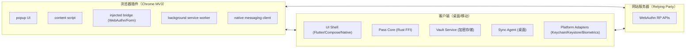
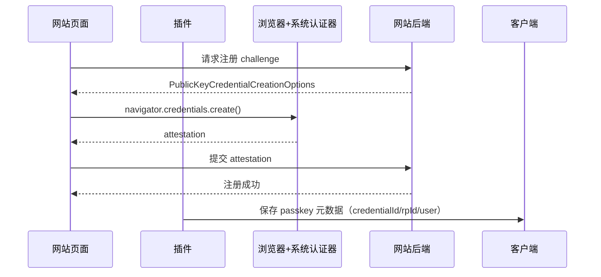
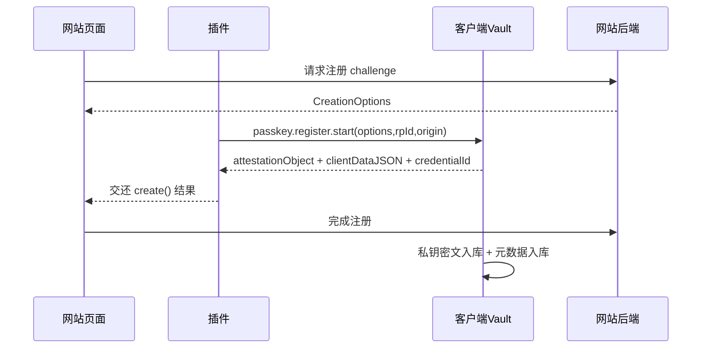

# 浏览器插件与客户端完整设计（含通行秘钥）

## 1. 目标与范围
- 目标：设计一套可落地的「浏览器插件 + 客户端（桌面/移动）」方案，统一支持密码、TOTP、恢复码、备注、通行秘钥（Passkey）。
- 范围：
  - 浏览器插件（MV3）架构、交互、权限、与客户端通信。
  - 客户端（Win/macOS/Linux/iOS/Android）架构、存储、安全、同步。
  - 通行秘钥原理、保存位置、注册/登录流程、同步边界。
  - 渐进式交付路径（先可用、再完整）。
- 不在本文件内展开：UI 细节视觉稿、商店上架流程细节、法务文本。

## 2. 通行秘钥原理与“保存到哪里”

## 2.1 核心原理
- 通行秘钥是 WebAuthn/FIDO2 公私钥认证，不是密码字符串。
- 注册时生成一对密钥：
  - `privateKey`：仅在认证器侧保存，不能明文上传网站。
  - `publicKey`：发给网站（RP）保存。
- 登录时客户端/认证器用 `privateKey` 对 challenge 签名，网站用 `publicKey` 验签。

## 2.2 保存位置总览
| 数据 | 存放位置 | 是否可同步到你自己的云 |
|---|---|---|
| `privateKey`（通行秘钥私钥） | 认证器（系统或你的托管保险库） | 可以（仅密文，E2EE） |
| `publicKey`、`credentialId` | 网站服务器（RP） | 不归你同步 |
| 通行秘钥元数据（站点、用户名、创建时间、设备） | 你的本地数据库 | 可以 |
| 密码/TOTP/恢复码/备注 | 你的本地数据库（密文） | 可以 |

## 2.3 两种可实现模式
- 模式 A（推荐先做）：`系统认证器模式`
  - 私钥在系统认证器（Keychain/Google Password Manager/Windows Hello 等）。
  - 你的产品只保存通行秘钥元数据。
  - 优点：实现快、风险低。
  - 缺点：通行秘钥本体跨生态可迁移性受系统限制。
- 模式 B（完整目标）：`托管认证器模式`
  - 私钥密文由你的客户端保险库管理（主密码+设备密钥保护）。
  - 插件/客户端协同参与 WebAuthn ceremony。
  - 优点：真正与密码库统一管理与同步。
  - 缺点：实现复杂、平台适配重。

## 3. 总体架构



## 4. 浏览器插件设计

## 4.1 模块拆分
- `background.js`：
  - 会话与消息路由中心。
  - 管理与客户端的连接（native messaging / local agent websocket）。
  - 处理保存提示、填充命令、同步触发。
- `content.js`：
  - 页面 DOM 登录表单检测。
  - 自动填充执行。
  - 向页面注入 WebAuthn bridge 脚本。
- `injected bridge`（新增）：
  - 运行在页面上下文，监听 `navigator.credentials.create/get` 触发点。
  - 把 webauthn 事件桥接给 content/background（不泄露敏感材料到不必要层）。
- `popup.*`：
  - 当前域名账号列表、快速复制、一键填充。
  - “保存账号/更新账号”确认。
  - “加入站点别名组”入口。
- `options.*`：
  - 设备名、导入导出、调试状态。

## 4.2 插件关键能力
- 当前域名识别：
  - 解析 `hostname` 与 eTLD+1。
  - 自动匹配同 eTLD+1 账号。
- 登录行为检测与保存提示：
  - 表单提交或登录成功信号后触发。
  - 若“站点+用户名+密码”完全一致则不提示。
- 通行秘钥行为检测：
  - 检测注册（`credentials.create`）与登录（`credentials.get`）开始/结束。
  - 按模式 A/B 路由到系统或客户端。

## 4.3 插件权限最小化建议
- 必需：`storage`, `tabs`, `activeTab`, `scripting`
- 可选按需：`nativeMessaging`, `clipboardWrite`
- `host_permissions`：
  - 初期可 `<all_urls>`，稳定后建议收敛为用户启用站点白名单策略。

## 4.4 插件本地数据边界
- 允许持久化：
  - 设备名、UI 设置、最近使用记录、配对会话缓存（短期）。
- 不应持久化：
  - 主密钥、解密后私钥、完整敏感字段明文。

## 5. 客户端设计（桌面 + 移动）

## 5.1 分层
- UI 层：列表、编辑、回收站、设置、同步中心。
- Core 层（Rust）：
  - 账号模型、别名组合并、op log、冲突合并、CSV。
- Vault 层：
  - 敏感字段密文存储。
  - passkey 私钥（仅模式 B）密文存储与访问策略。
- 平台适配层：
  - Keychain/Keystore/DPAPI/libsecret。
  - 生物识别解锁。
  - 自动填充/凭据提供（移动端）。
- Sync Agent（桌面）：
  - 本地网络配对、pull/push、冲突回传。
  - 插件和移动端的统一桥接入口。

## 5.2 客户端进程建议
- 桌面：
  - `PassApp`（UI）
  - `PassAgent`（后台同步与插件通信，可合并进同进程的独立模块）
- 移动：
  - App 主进程 + 系统凭据扩展（iOS Credential Provider / Android Credential Manager Provider）

## 6. 数据模型（插件与客户端统一语义）

## 6.1 账号主表（沿用现有规则）
- `account_id = 站点别名第一行(归一化) + "-" + username_at_create + "-" + yyyyMMddHHmmss`
- `sites`：站点别名数组（升序去重）
- 字段更新时间：`username/password/totp/recovery_codes/note_updated_at_ms`
- 删除语义：`is_deleted + deleted_at_ms`

## 6.2 通行秘钥表（新增）
```sql
CREATE TABLE passkey_credentials (
  credential_id TEXT PRIMARY KEY,         -- base64url
  account_id TEXT NOT NULL,
  rp_id TEXT NOT NULL,                    -- e.g. "google.com"
  user_handle_b64 TEXT,                   -- 可空
  username TEXT,                          -- 展示名
  display_name TEXT,
  alg INTEGER NOT NULL,                   -- COSE alg
  aaguid TEXT,                            -- 可空
  transports_json TEXT,                   -- ["internal","hybrid","usb"]
  sign_count INTEGER NOT NULL DEFAULT 0,
  backup_eligible INTEGER NOT NULL DEFAULT 0,
  backup_state INTEGER NOT NULL DEFAULT 0,
  mode TEXT NOT NULL,                     -- "system" | "managed"
  private_key_ref TEXT,                   -- mode=system: 系统引用; mode=managed: vault key id
  created_at_ms INTEGER NOT NULL,
  updated_at_ms INTEGER NOT NULL,
  deleted INTEGER NOT NULL DEFAULT 0
);
```

## 6.3 私钥密文表（仅模式 B）
```sql
CREATE TABLE passkey_private_blobs (
  key_ref TEXT PRIMARY KEY,
  cipher_blob BLOB NOT NULL,              -- privateKey + metadata 密文
  dek_id TEXT NOT NULL,
  kek_version INTEGER NOT NULL,
  created_at_ms INTEGER NOT NULL,
  updated_at_ms INTEGER NOT NULL
);
```

## 6.4 同步操作（op log）扩展字段
- 新增 `field_name` 值：
  - `passkey_create`
  - `passkey_delete`
  - `passkey_sign_count`
  - `passkey_meta_update`

## 7. 通行秘钥保存与登录流程

## 7.1 模式 A：系统认证器（MVP）


说明：
- 私钥不进入你的数据库，仅保留元数据。
- 登录时同理，浏览器调用系统认证器完成签名，插件只做识别与展示。

## 7.2 模式 B：托管认证器（目标）


说明：
- 托管模式下，插件与客户端需要稳定低延迟通道。
- 私钥始终以密文形式存储，解密仅在解锁会话内短时驻留。

## 8. 插件 <-> 客户端协议设计（本地）

## 8.1 传输
- 桌面浏览器优先：`Native Messaging`（插件到本机客户端桥接）。
- 备选：本地回环地址 `https://127.0.0.1:<port>` + 双向认证 token。

## 8.2 消息结构
```json
{
  "id": "req_01H...",
  "method": "passkey.register.start",
  "origin": "https://accounts.example.com",
  "tab_id": 123,
  "payload": {}
}
```

响应：
```json
{
  "id": "req_01H...",
  "ok": true,
  "result": {},
  "error": null
}
```

## 8.3 核心方法
- `vault.queryByDomain`
- `password.saveOrUpdate`
- `password.fill`
- `passkey.register.start`
- `passkey.authenticate.start`
- `sync.trigger`
- `device.pair.start` / `device.pair.confirm`

## 8.4 错误码
- `LOCK_REQUIRED`
- `USER_CANCELLED`
- `RP_ID_MISMATCH`
- `ORIGIN_NOT_TRUSTED`
- `CREDENTIAL_NOT_FOUND`
- `KEY_NOT_AVAILABLE`
- `PAIR_REQUIRED`
- `RATE_LIMITED`

## 9. 同步与冲突合并设计

## 9.1 同步单位
- 统一用 `op` 增量同步，不传整表快照。
- 幂等键：`op_id = device_id + counter`。

## 9.2 通行秘钥冲突规则
- `passkey_create`：
  - 同 `credential_id` 重复创建 => 幂等忽略。
- `passkey_delete`：
  - 删除时间晚于目标记录全部字段更新时间 => 保持删除。
  - 否则进入冲突审阅或默认恢复（防误删策略）。
- `passkey_sign_count`：
  - 合并取 `max(sign_count)`，禁止回退。
- `passkey_meta_update`：
  - 按字段更新时间与 HLC 决胜。

## 9.3 域名别名与 passkey 的关系
- 账号级别别名组用于“候选展示”和“自动填充召回”。
- passkey 必须严格校验 `rp_id`，不能因别名组跨 eTLD+1 直接混用。

## 10. 安全设计

## 10.1 密钥层级
- `Master Password` --Argon2id--> `KEK`
- 每条敏感记录随机 `DEK`
- `DEK` 用 `KEK` 包裹后存储
- 模式 B passkey 私钥只存 `cipher_blob(privateKey, meta)`

## 10.2 运行时安全
- 应用锁：
  - 退出前不锁定 / 空闲 N 分钟锁定 / 后台即锁定（可配置）
- 生物识别：
  - 仅在设置主密码并启用解锁后申请系统权限
- 剪贴板：
  - 自动清空（默认 30s，可配置）

## 10.3 Web 安全边界
- 所有 passkey 操作强校验：
  - `origin`
  - `rpId`
  - `top-level frame` 场景
- 禁止在 http 非安全上下文执行通行秘钥流程（开发本地例外白名单）。

## 11. 平台适配设计

## 11.1 Windows/macOS/Linux（桌面）
- 插件 + 客户端通过 native messaging / local agent 通信。
- 安全存储：
  - Windows：DPAPI + 可选 Windows Hello
  - macOS：Keychain + Secure Enclave（可用时）
  - Linux：libsecret（无 keyring 时给出降级风险提示）

## 11.2 iOS/Android（移动）
- iOS：Credential Provider Extension（含 passkey）
- Android：Credential Manager Provider
- 移动端 APP 不直接获取“浏览器当前域名”，域名上下文来自：
  - 系统自动填充/凭据框架回调
  - 或与浏览器插件/桌面 Agent 协议同步

## 12. 开发分阶段（推荐）

## 12.1 阶段 P0（当前基线）
- 已有密码/TOTP/恢复码/备注/别名/回收站/CSV/本地+iCloud（mac）。
- 已有 Chrome 扩展登录保存提示与填充基础能力。

## 12.2 阶段 P1（2~4 周）
- 插件新增 WebAuthn 事件检测管线。
- 客户端新增 `passkey_credentials` 元数据存储。
- 先落地模式 A（系统认证器），实现“可见、可管理、可同步元数据”。

## 12.3 阶段 P2（4~8 周）
- 桌面通道升级：native messaging 双向可靠消息 + 请求取消。
- 端到端完善：注册/登录事件审计、异常重试、冲突提示。

## 12.4 阶段 P3（6~12 周）
- 落地模式 B（托管认证器）：
  - 私钥密文存储
  - 本地解锁策略
  - 插件 ceremony 路由到客户端
- 扩展到 iOS/Android 平台 provider 集成。

## 13. 验收标准（Definition of Done）
- 插件：
  - 登录提交后能正确提示保存/更新，重复不提示。
  - 右键/弹窗可快速填充并审计。
  - WebAuthn 注册/登录至少有可观测事件与记录。
- 客户端：
  - 账号与敏感字段全程密文存储。
  - 回收站、CSV、同步冲突收敛符合既定规则。
  - 解锁策略与生物识别策略按设置生效。
- 通行秘钥：
  - 模式 A：元数据完整可管理，登录流程不受影响。
  - 模式 B：私钥不明文落盘，跨设备同步后可用（按策略）。

## 14. 与当前仓库模块映射
- 插件目录：`apps/extension_chrome`
- mac 客户端目录：`apps/app_macos`
- 核心目录：`core/pass_core`
- 同步代理目录：`apps/sync_agent_desktop`
- 协议参考：`docs/sync-protocol-contract-zh.md`
- 总体架构参考：`docs/cross-platform-architecture-zh.md`

