# 跨平台密码管理器实施方案（共享核心 + 共享UI + 平台适配层）

## 1. 文档目标
- 支持平台：Windows、macOS、Linux、iOS、Android、浏览器扩展。
- 核心策略：业务与安全逻辑最大化共享，平台能力按适配层隔离。
- 输出目标：让团队可直接据此拆任务、建仓库、启动开发与发布。

## 1.1 关联文档
- 总体设计：[password-manager-design-zh.md](/Users/x/code/pass/docs/password-manager-design-zh.md)
- 完整实施规范：[implementation-spec-full-zh.md](/Users/x/code/pass/docs/implementation-spec-full-zh.md)
- 同步协议契约：[sync-protocol-contract-zh.md](/Users/x/code/pass/docs/sync-protocol-contract-zh.md)
- 数据库 DDL：[sqlite-schema.sql](/Users/x/code/pass/docs/sqlite-schema.sql)

## 2. 结论与决策

### 2.1 推荐最终形态
- **共享核心（强约束）**：一套核心库，负责模型、加密、同步、冲突合并、CSV。
- **共享UI（建议）**：一套 UI 框架覆盖五端，减少页面重复实现。
- **平台适配层（必须）**：仅保留系统 API 差异（密钥库、生物识别、自动填充、托盘、权限）。

### 2.2 UI 方案建议
- 方案 A（默认）：`Flutter`
  - 一套代码覆盖 iOS/Android/Windows/macOS/Linux。
  - 优点：交付速度快、生态成熟、桌面/移动一致性高。
- 方案 B（备选）：`Compose Multiplatform`
  - Kotlin 技术栈统一度高，适合已有 Kotlin 团队。
  - 缺点：相对 Flutter，部分周边生态和团队可用人力可能更窄。

### 2.3 核心库语言建议
- 推荐：`Rust` 作为共享核心（安全性、性能、跨平台编译与 FFI 稳定）。
- 备选：`Kotlin Multiplatform` 作为共享核心（若团队 Kotlin 优势明显）。

> 本文以下以“Flutter + Rust Core”作为默认落地方案描述；若选 Compose，仅替换 UI 层，不改核心分层与协议。

## 3. 总体架构

```mermaid
flowchart LR
  subgraph UI["Shared UI (Flutter or Compose)"]
    A1["Account List"]
    A2["Account Detail/Edit"]
    A3["Sync Center"]
    A4["Alias Group Manager"]
  end

  subgraph Core["Shared Core (Rust)"]
    C1["Domain Model"]
    C2["Crypto Engine"]
    C3["Op Log + Merge Engine"]
    C4["Storage Abstraction"]
    C5["CSV Import/Export"]
  end

  subgraph Adapter["Platform Adapters"]
    P1["Secure Key Store"]
    P2["Biometric Auth"]
    P3["Autofill Integration"]
    P4["Local Network & Permissions"]
    P5["Desktop Tray/IPC"]
  end

  subgraph Sync["Local Sync Agent + Browser Extension"]
    S1["Sync Agent (Desktop)"]
    S2["QR Pairing"]
    S3["Extension Fill UI"]
  end

  UI --> Core
  Core --> Adapter
  UI --> Sync
  Sync --> Core
```



## 4. 代码仓结构（Monorepo）

```txt
pass/
  apps/
    app_flutter/                    # 五端共享 UI
    extension_chrome/               # 浏览器扩展（MV3）
    sync_agent_desktop/             # 桌面本地同步代理
  core/
    pass_core/                      # Rust workspace
      crates/
        domain/                     # 数据模型与规则
        crypto/                     # Argon2id/AES-GCM/密钥轮换
        merge/                      # op log + HLC + 冲突合并
        storage/                    # SQLite/SQLCipher 适配
        transport/                  # 同步协议编解码
        csvio/                      # CSV 导入导出
      ffi/                          # Uniffi 或 cbindgen bindings
  adapters/
    flutter_plugins/
      secure_store/                 # Keychain/Keystore/DPAPI/libsecret
      biometric/                    # FaceID/TouchID/BiometricPrompt
      autofill/                     # iOS/Android 自动填充桥接
      local_network/                # 权限与网络状态桥接
  docs/
    password-manager-design-zh.md
    cross-platform-architecture-zh.md
```

## 5. 分层职责与边界

### 5.1 Shared Core（不可下沉到 UI）
- 账号模型、域名别名规则、eTLD+1 归一化。
- 加密（主密钥派生、字段加解密、密钥封装）。
- 离线同步（op log、向量时钟、HLC、真实时间区间比较）。
- 冲突合并与删除判定。
- CSV 导入导出与幂等处理。

### 5.2 Shared UI（可替换）
- 页面渲染与交互状态。
- 调用核心 API，不持有业务规则。
- 展示冲突解释与审计记录。

### 5.3 Platform Adapter（仅处理平台差异）
- 密钥安全存储（系统密钥库）。
- 生物识别解锁。
- 自动填充接口。
- 本地网络权限、后台任务、系统托盘。

## 6. 核心接口设计（示例）

### 6.1 核心 API（FFI 暴露）
```ts
interface CoreApi {
  initDevice(input: { deviceName: string; platform: string }): DeviceInfo;
  createAccount(input: CreateAccountInput): AccountView;
  updateField(input: UpdateFieldInput): AccountView;
  deleteAccount(input: { accountId: string }): AccountView;
  undeleteAccount(input: { accountId: string }): AccountView;
  mergeOps(input: { localOps: Op[]; remoteOps: Op[] }): MergeResult;
  exportCsv(input: { path: string }): ExportResult;
  importCsv(input: { path: string }): ImportResult;
}
```

### 6.2 平台适配接口（UI 调用）
```ts
interface SecureStoreAdapter {
  saveMasterKeyEnvelope(data: Uint8Array): Promise<void>;
  loadMasterKeyEnvelope(): Promise<Uint8Array | null>;
}

interface BiometricAdapter {
  canAuthenticate(): Promise<boolean>;
  authenticate(reason: string): Promise<boolean>;
}

interface AutofillAdapter {
  isSupported(): Promise<boolean>;
  openSystemAutofillSettings(): Promise<void>;
}
```

## 7. 跨平台适配清单

### 7.1 Windows
- 安全存储：DPAPI（用户作用域）+ 可选 Windows Hello 解锁门槛。
- 桌面能力：系统托盘、开机启动、单实例锁、日志路径规范。

### 7.2 macOS
- 安全存储：Keychain + Secure Enclave（可用时）。
- 桌面能力：菜单栏托盘、Notarization、沙盒权限说明。

### 7.3 Linux
- 安全存储：`libsecret`（GNOME Keyring/KWallet 兼容层）。
- 兼容策略：Wayland/X11 差异处理，发行版打包（AppImage/deb/rpm）。

### 7.4 iOS
- 安全存储：Keychain + 生物识别（Face ID/Touch ID）。
- 自动填充：Credential Provider Extension（独立 extension target）。
- 网络权限：本地网络访问用途说明（首次授权弹窗）。

### 7.5 Android
- 安全存储：Android Keystore + BiometricPrompt。
- 自动填充：Autofill Service。
- 权限：Android 13+ 附近设备/Wi-Fi 相关权限按需申请。

## 8. 浏览器扩展与 APP 协同

### 8.1 组件职责
- 扩展：识别网页域名、自动填充 UI、发起配对扫码。
- 桌面 Sync Agent：局域网监听、会话管理、加密通道、增量同步。
- APP：核心数据源之一，离线编辑后与 Agent/其他设备合并。

### 8.2 协议关键点
- 配对：一次性 token + 短时过期 + 设备公钥绑定。
- 同步：增量 op 交换（`version_vector`）+ 幂等去重（`op_id`）。
- 安全：TLS/Noise + pin，防中间人与重放。

## 9. 数据与同步模型（实施要点）

### 9.1 主表与日志表
- `accounts`：当前状态快照（便于查询）。
- `op_logs`：变更事实（同步真源）。
- `alias_groups`：域名别名组。
- `version_vectors`：每设备已见进度。

### 9.2 合并原则
- 同字段：`因果关系 > 真实时间区间 > HLC > op_id`。
- `sites`：OR-Set 收敛，防多端 add/remove 乱序。
- 删除冲突：默认防误删，区间重叠进入 `conflict_review`。

## 10. 安全设计

### 10.1 密钥层级
- `Master Password` -> Argon2id -> `KEK`。
- 随机生成 `DEK` 加密字段（password/totp/recovery/note）。
- `DEK` 由 `KEK` 包裹后存储；`KEK` 不落盘明文。

### 10.2 强制策略
- 主密码错误重试节流与锁定窗口。
- 剪贴板敏感信息自动过期清除。
- 日志脱敏（不记录明文账号、密码、TOTP）。
- 导入导出文件二次确认与完整性校验。

## 11. 工程与发布

### 11.1 CI/CD（最低要求）
- Core：单元测试 + 属性测试 + FFI ABI 兼容检查。
- UI：快照测试 + 集成测试 + 多平台冒烟。
- 安全：SAST、依赖漏洞扫描、签名工件校验。

### 11.2 打包发布
- Windows：MSIX/EXE 签名。
- macOS：签名 + Notarization。
- Linux：AppImage + deb/rpm（首发至少一种）。
- iOS/Android：商店发布流水线与崩溃符号上传。

## 12. 里程碑与交付定义

### M1（4-6 周）
- 完成 Rust Core 最小闭环：账号 CRUD、加密存储、CSV。
- Flutter UI 完成登录、列表、详情编辑。
- iOS/Android 生物识别与安全存储接入。

### M2（4-6 周）
- 完成离线 op log + 合并引擎（含删除冲突规则）。
- 完成桌面 Sync Agent 与扫码配对。
- 完成扩展最小自动填充与同步触发。

### M3（3-5 周）
- 完成五端联调、冲突可视化、导入导出回放。
- 完成安全测试与发布流程。

### Done 标准
- 五平台可安装运行。
- 任意两设备离线编辑后重连能收敛到一致结果。
- 关键数据全程密文存储，且通过基础渗透与回归测试。

## 13. 关键风险与应对
- 风险：平台权限差异导致同步不可用。  
  应对：权限前置检查 + 失败降级（手动导入导出）。
- 风险：时钟漂移引发冲突误判。  
  应对：TrueTime 区间 + HLC + 人工冲突审阅入口。
- 风险：桌面分发复杂。  
  应对：先定单一发行格式，再逐步扩展。

## 14. 立即可执行的下一步
1. 定版技术栈：Flutter + Rust（或 Compose + KMP）。
2. 落库 DDL：`accounts/op_logs/alias_groups/version_vectors`。
3. 搭建 `core/pass_core` workspace 与 FFI hello-world。
4. 建立 Flutter 五端工程与 adapter 插件骨架。
5. 建立 Sync Agent 原型（配对 + pull/push 最小接口）。
