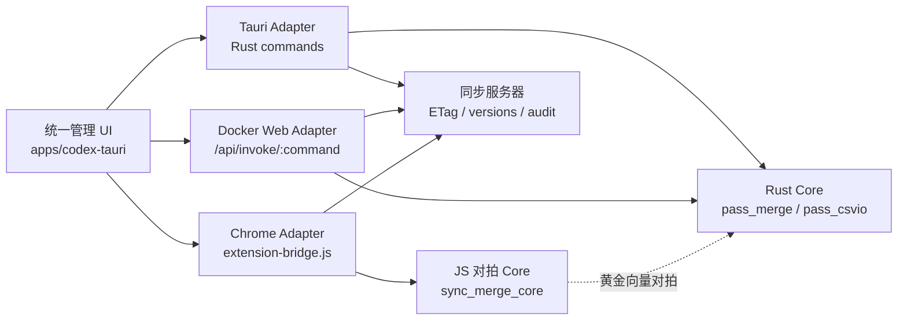

# Pass 跨平台实施架构

> 当前代码架构，不是早期技术选型蓝图。产品管理面已统一为 Tauri / Docker Web / Chrome Web 扩展；移动端继续使用平台原生系统集成。

## 1. 当前技术决策

- **共享核心**：Rust `core/pass_core`，负责数据模型、域名规则、CSV 和权威合并语义。
- **共享管理 UI**：`apps/codex-tauri` 的 HTML/CSS/JavaScript 是唯一源码，同时服务 Tauri、Docker Web 和 Chrome Web 扩展。
- **平台适配**：Tauri Rust commands、Web HTTP RPC、Chrome extension bridge 分别接同名命令。
- **同步服务**：Ubuntu Python 服务只负责认证、快照、版本、ETag/CAS 和审计，不做业务合并。
- **系统能力**：浏览器填充/WebAuthn、macOS AutoFill/Credential Exchange、Android Credential Provider 留在平台层。

Flutter/Compose 和独立桌面 Sync Agent 不再是当前产品路线；旧技术对比只保留在根 README 的历史选型章节。

## 2. 运行架构


```mermaid
flowchart LR
  UI["统一管理 UI\napps/codex-tauri"]
  T["Tauri Adapter\nRust commands"]
  W["Docker Web Adapter\n/api/invoke/:command"]
  E["Chrome Adapter\nextension-bridge.js"]
  R["Rust Core\npass_merge / pass_csvio"]
  J["JS 对拍 Core\nsync_merge_core"]
  S["同步服务器\nETag / versions / audit"]

  UI --> T
  UI --> W
  UI --> E
  T --> R
  W --> R
  E --> J
  T --> S
  W --> S
  E --> S
  J -.黄金向量对拍.-> R
```

## 3. 仓库结构

```text
pass/
  VERSION                         # 全项目唯一版本源
  apps/
    codex-tauri/                  # 统一 UI + Win/macOS/Linux 桌面端
    pass-web/                     # Docker/Ubuntu 无 GUI Web 后端
    extension_chrome_web/         # 新版统一管理页扩展适配
    extension_shared/             # popup/填充/passkey 共享实现
    extension_firefox|safari/     # Firefox/Safari 平台壳
    app_macos/                    # 旧 SwiftUI 与 macOS 系统能力
    android_credential_provider/  # Android 14+ Provider 开发中
    sync_server_local/            # macOS 本地启动/launchd 脚本
    sync_server_ubuntu/           # 自建同步服务器
  core/pass_core/                 # Rust workspace + JS 对拍实现
  scripts/                        # 构建、版本、契约和测试门禁
```

## 4. 分层边界

| 层 | 负责 | 不负责 |
|---|---|---|
| Rust Core | 领域模型、合并、墓碑、顺序、CSV | UI、平台权限、远端持久化 |
| 统一 UI | 展示、交互、命令调用 | 复制业务合并规则 |
| 平台 Adapter | 文件选择、生物识别、存储、HTTP/Chrome API | 私自改变同步语义 |
| 扩展内容层 | 域名识别、填充、保存提示、WebAuthn | 暴露全库明文给页面 |
| 同步服务器 | Token、ETag、版本、审计、持久化 | 字段级合并、解密用户数据 |

## 5. 数据与同步

- 数据契约：`pass.data.v2` / `pass.sync.bundle.v2`。
- 合并：字段级 LWW + 确定性并列裁决。
- 删除：永久删除墓碑保留稳定 ID，清除敏感字段。
- 关系：文件夹归属、站点别名、passkey 关联使用关系状态/墓碑。
- 顺序：顶层 `allRegularAccountIds`、`folderOrderIds`，文件夹内 `regularAccountIds`。
- 并发：客户端合并，服务器用 `ETag` / `If-Match` 阻止静默覆盖。
- Token 与同步密钥均允许留空；项目不会自动生成 Bearer Token。

## 6. 平台能力

| 能力 | Tauri | Docker Web | Chrome Web 扩展 |
|---|---|---|---|
| 统一管理 UI | 是 | 是 | 是 |
| 自建服务器同步 | 是 | 是 | 是 |
| WebDAV | 是 | 是 | 否 |
| SSH 创建服务 | 是 | 草稿/检测 | 草稿 |
| 本地快照/历史/撤销重做 | 是 | 是 | 是 |
| Touch ID | macOS | 否 | 否 |
| 页面填充/WebAuthn | 否 | 否 | 是 |

## 7. 版本与验证

根目录 `VERSION` 是唯一版本源。`scripts/bump_version.sh` 按 `0.0.1` 递增并满十进一；`scripts/version.mjs check` 检查代码、锁文件、工程文件和现行文档版本一致。

主要门禁：

```bash
node scripts/version.mjs check
bash scripts/core_gate.sh
node scripts/check_command_matrix.mjs
python -m unittest discover -s scripts/tests -p 'test_*.py'
```

## 8. 后续方向

1. 扩大命令返回 schema 契约测试，减少适配层返回形状差异。
2. 将更多 JS 合并辅助逻辑继续下沉或与 Rust 使用黄金向量对拍。
3. 完成 Android Provider 的真实 vault 解锁和凭据回填；再启动 iOS 原生 Provider。
4. 完善多用户 Web 隔离、WebAuthn 登录、发布签名和多架构镜像。
