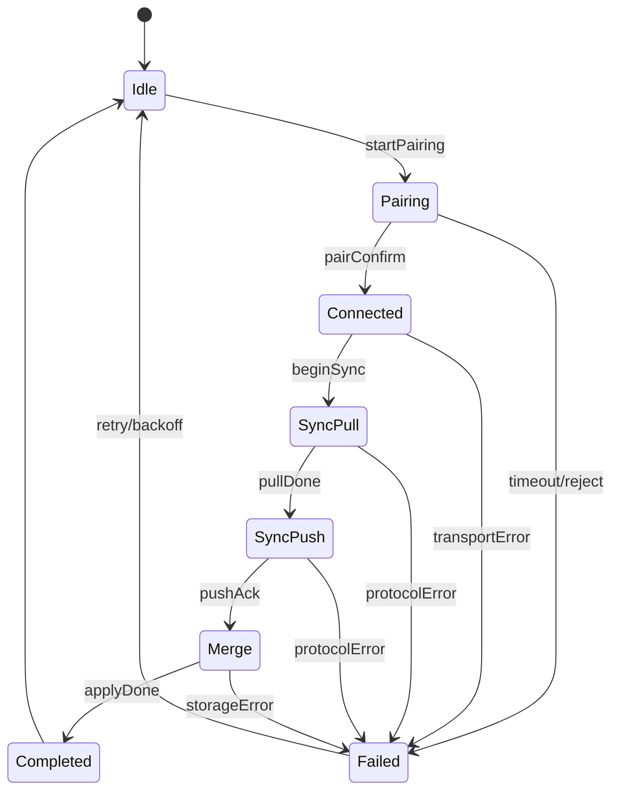
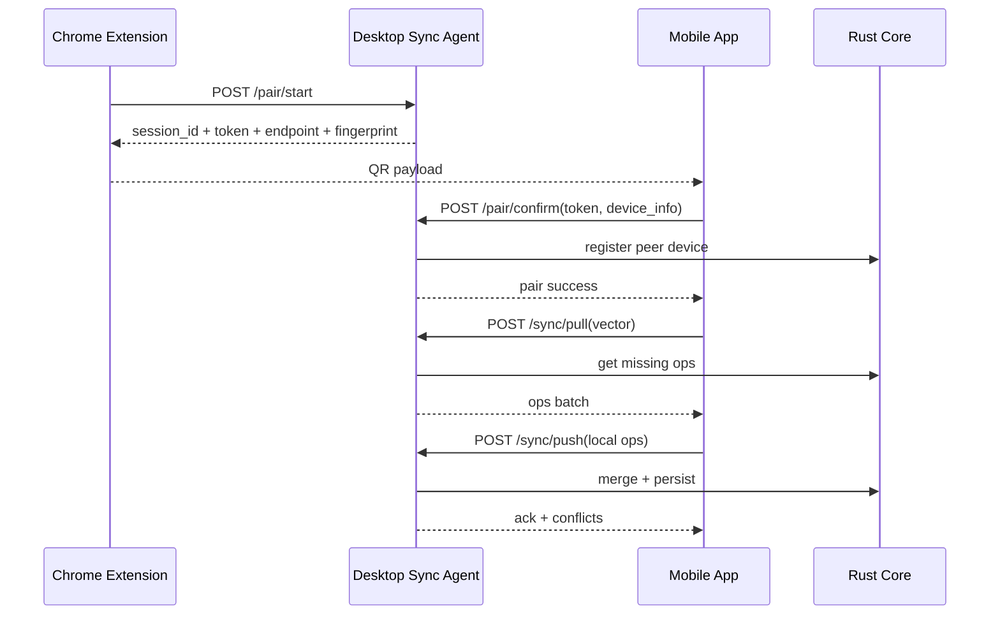

# 跨平台密码管理器完整实施规范（V1）

## 1. 范围与目标
- 覆盖端：Windows、macOS、Linux、iOS、Android、Chrome 扩展。
- 架构目标：共享核心 + 共享 UI + 平台适配层。
- 业务目标：
  - 支持账号、密码、TOTP、恢复码、备注。
  - 支持域名别名组（含跨 eTLD+1 手动确认）。
  - 支持离线编辑后多端同步收敛。
  - 支持 CSV 导入导出。
- 安全目标：
  - 敏感字段全程密文存储。
  - 设备配对与同步链路加密。
  - 同步幂等，支持审计与回放。

## 2. 非功能要求（必须达标）
- 可用性：
  - APP 启动到可操作界面 < 2.5s（中端设备）。
  - 本地 1 万条账号检索 < 200ms（缓存命中）。
- 可靠性：
  - 同步请求支持断点续传与重试（指数退避 + 抖动）。
  - 任意设备重放同批次 op，结果必须一致。
- 可维护性：
  - 核心规则只保留一份实现（Rust Core）。
  - UI 层不得复制冲突合并规则。
- 合规性：
  - 明确数据最小化与日志脱敏策略。
  - 提供用户可导出的审计记录。

## 3. 读文档顺序
1. [cross-platform-architecture-zh.md](/Users/x/code/pass/docs/cross-platform-architecture-zh.md)
2. [implementation-spec-full-zh.md](/Users/x/code/pass/docs/implementation-spec-full-zh.md)
3. [sync-protocol-contract-zh.md](/Users/x/code/pass/docs/sync-protocol-contract-zh.md)
4. [sqlite-schema.sql](/Users/x/code/pass/docs/sqlite-schema.sql)

## 4. 组件与职责

### 4.1 Rust Core（唯一业务真源）
- `domain`：账户模型、域名归一化、别名组合并规则。
- `crypto`：Argon2id、DEK/KEK 封装、字段加解密。
- `merge`：op log、HLC、TrueTime 区间比较、冲突判定。
- `storage`：SQLCipher 持久化与迁移。
- `transport`：同步协议消息模型。
- `csvio`：CSV 导入导出。

### 4.2 Shared UI（Flutter）
- 页面：首次引导、列表、详情、别名组、同步中心、安全中心。
- 职责：展示与操作，不承载业务规则。
- 数据源：仅通过 FFI 调核心 API。

### 4.3 Platform Adapter
- `secure_store`：平台密钥库存取封装。
- `biometric`：生物识别能力检测与认证。
- `autofill`：移动端自动填充桥接。
- `local_network`：局域网权限与网络状态桥接。

### 4.4 Sync Agent（桌面）
- 局域网监听、配对会话管理、同步请求入口。
- 与 Core 共用协议模型与合并规则。
- 为浏览器扩展和移动端提供安全同步中继。

### 4.5 Chrome 扩展
- 检测当前域名与 eTLD+1。
- 弹窗自动填充与别名组操作入口。
- 触发配对二维码展示与同步。

## 5. 关键业务规则（不可改动）

### 5.1 主键规则
- `account_id = canonical_site + "-" + created_at_yyMMddHHmmss + "-" + username_at_create`
- 首次创建后不可修改。

### 5.2 域名规则
- 同 eTLD+1 自动共用账号候选（如 `qq.com` / `wx.qq.com`）。
- 跨 eTLD+1 仅允许人工确认后加入同一别名组。
- 别名组合并后要回填同组账户的 `sites` 字段（升序去重）。

### 5.3 同步规则
- 同步单位是 `op`（操作事件），不是整条账号快照。
- 冲突比较顺序：
  - 因果关系（happened-before）
  - 真实时间区间（lower/upper）
  - HLC（physical/logical）
  - `op_id` 字典序
- 删除冲突：默认防误删，无法确定时进入 `conflict_review`。

## 6. 核心数据结构（接口层）

```ts
type Account = {
  accountId: string;
  canonicalSite: string;
  sites: string[];
  aliasGroupId: string;
  username: string;
  passwordCipher: Uint8Array;
  totpSecretCipher: Uint8Array;
  recoveryCodesCipher: Uint8Array;
  noteCipher: Uint8Array;
  usernameUpdatedAtMs: number;
  passwordUpdatedAtMs: number;
  totpUpdatedAtMs: number;
  recoveryCodesUpdatedAtMs: number;
  noteUpdatedAtMs: number;
  isDeleted: boolean;
  deletedAtMs?: number;
  conflictReview: boolean;
  lastOperatedDeviceId: string;
  createdAtMs: number;
  updatedAtMs: number;
};

type Op = {
  opId: string;                 // device_id + counter
  deviceId: string;
  deviceCounter: number;
  accountId: string;
  fieldName: "username" | "password" | "totp" | "recovery_codes" | "note" | "sites" | "delete_flag";
  opType: "set" | "delete" | "undelete" | "add_alias" | "remove_alias";
  valueCipher?: Uint8Array;
  valueJson?: string;
  hlcPhysicalMs: number;
  hlcLogical: number;
  eventTimeMsLocal: number;
  clockOffsetMs: number;
  clockUncertaintyMs: number;
  lowerBoundMs: number;
  upperBoundMs: number;
  causalParents: string[];
};
```

## 7. 模块级接口（FFI）

### 7.1 设备与密钥
- `init_device(device_name, platform) -> device_info`
- `bootstrap_master_password(password, params) -> key_info`
- `unlock_with_password(password) -> session_token`
- `unlock_with_biometric() -> session_token`

### 7.2 账号与别名组
- `create_account(input) -> account`
- `update_account_field(account_id, field, value) -> account`
- `delete_account(account_id) -> account`
- `undelete_account(account_id) -> account`
- `add_domain_alias(account_id, domain) -> alias_group`
- `remove_domain_alias(account_id, domain) -> alias_group`

### 7.3 同步
- `build_sync_pull(peer_id, vector) -> pull_request`
- `apply_sync_push(peer_id, ops) -> push_result`
- `merge_remote_ops(peer_id, ops) -> merge_result`

### 7.4 导入导出
- `export_csv(path, include_deleted) -> report`
- `import_csv(path, mode) -> report`

## 8. 同步状态机（设备侧）



## 9. 配对与同步的时序（高层）



## 10. UI 页面定义（MVP）

### 10.1 首次引导
- 输入设备名。
- 设置主密码。
- 启用生物识别（可跳过）。
- 导入 CSV（可跳过）。

### 10.2 账号列表
- 搜索（域名/用户名）。
- 过滤（已删除、需冲突审阅）。
- 快速复制（密码/TOTP，带自动清空计时）。

### 10.3 账号详情
- 显示字段与最后更新时间。
- 编辑字段时生成 op 并立即本地提交。
- 删除/恢复入口。

### 10.4 域名别名组管理
- 展示别名组内域名列表。
- 跨 eTLD+1 操作二次确认。

### 10.5 同步中心
- 显示对端设备列表与信任状态。
- 显示上次同步时间、结果、冲突数。
- 支持手动同步与重试。

## 11. 平台实现要求（必须）

### 11.1 iOS
- Keychain 存储 `KEK envelope`。
- 生物识别使用 `LocalAuthentication`。
- 本地网络权限文案必须明确“与本机浏览器扩展同步用途”。
- 自动填充通过 Credential Provider Extension。

### 11.2 Android
- Keystore 存储密钥包裹材料。
- 生物识别使用 BiometricPrompt。
- Autofill Service 实现账号建议与填充。
- 权限按最小化申请，不使用时不请求。

### 11.3 Windows
- DPAPI + 可选 Windows Hello 门禁。
- 托盘常驻与单实例互斥。

### 11.4 macOS
- Keychain + 可选 Secure Enclave。
- 托盘菜单、签名、Notarization。

### 11.5 Linux
- `libsecret` 适配优先。
- 无 keyring 时降级为“仅会话可用”并提示风险。

## 12. 安全控制清单
- 主密码派生参数固定版本化（支持未来迁移）。
- 错误尝试节流：5 次后指数退避。
- 剪贴板自动清空：默认 30 秒，可配置上限 120 秒。
- 导出 CSV 默认不含已删除记录，可手动勾选。
- 日志中禁止输出明文字段和完整 token。
- 配对 token 一次性使用，默认 60 秒过期。

## 13. 可观测性与审计
- 记录事件：
  - `account_created/account_updated/account_deleted/account_restored`
  - `sync_started/sync_completed/sync_failed`
  - `pair_started/pair_confirmed/pair_failed`
- 审计导出：JSONL/CSV，字段脱敏。
- 指标：
  - `sync_success_rate`
  - `sync_p95_latency_ms`
  - `merge_conflict_rate`
  - `unlock_failure_rate`

## 14. 测试策略（发布门槛）
- 单元测试：
  - 域名归一化/eTLD+1。
  - HLC 与时间区间比较。
  - 删除冲突判定。
- 属性测试：
  - op 乱序重放后的收敛一致性。
  - 重复 op 应用幂等性。
- 集成测试：
  - 离线编辑 -> 重连同步 -> 冲突处理。
  - CSV 导入与历史数据回放。
- 端到端：
  - 扩展扫码配对 -> APP 同步 -> 网页自动填充。

## 15. 项目阶段拆解（建议）

### 阶段 A：核心闭环（4 周）
- 完成 DDL、迁移、核心 CRUD、字段加密。
- 完成 op log 写入与基础 merge。
- 交付：命令行回归脚本可跑通。

### 阶段 B：五端 UI + 适配层（5 周）
- Flutter 五端项目骨架。
- iOS/Android 生物识别与自动填充桥接。
- Windows/macOS/Linux 安全存储适配。

### 阶段 C：扩展 + 同步代理（4 周）
- 扩展自动填充 MVP。
- 同步代理配对与 pull/push。
- 多设备冲突可视化。

### 阶段 D：发布与安全（3 周）
- 签名与打包流水线。
- 安全测试与审计导出。
- 首轮灰度发布。

## 16. 交付清单（Definition of Done）
- 文档：
  - 架构说明
  - 协议契约
  - 数据库 DDL
  - 运维与发布手册
- 代码：
  - Rust Core + FFI
  - Flutter 五端 UI
  - 平台适配插件
  - Sync Agent
  - Chrome 扩展
- 质量：
  - 核心测试覆盖率 >= 80%
  - 关键同步场景 e2e 全通过
  - 安全基线检查全通过
